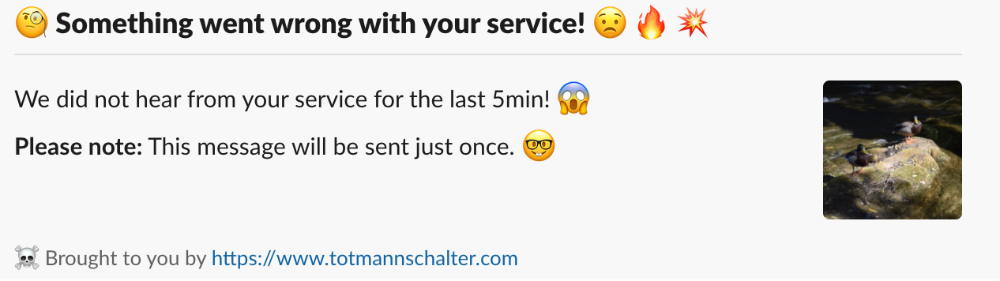

# Totmannschalter

Totmannschalter (German for dead man's switch) is a simple service that notifies you when it has not received any
message from a service for a period of time. It is provided free to use by the German health
insurance [BKK VBU](https://vbu.tech).

## Usage

Currently, only Slack integration is supported.

1. Create a Slack webhook: https://api.slack.com/messaging/webhooks. It's important to use one dedicated webhook per
   Prometheus instance, as the webhook is used to keep track of which services have not sent a request recently. The
   webhook will have a format like https://hooks.slack.com/services/Tttttttt/Bbbbbbb/Xxxxxxxxx
2. Regularly send a HTTP POST request to https://totmannschalter.com/slack/Tttttttt/Bbbbbbb/Xxxxxxxxx using the last
   three parts of the webhook from step 1. The request body is ignored.
3. If no request was received for 5 minutes, Totmannschalter will send a one-time message via the Slack webhook like
   this: 

## Prometheus / Alertmanager integration

If you are using Prometheus and Alertmanager, you can use Totmannschalter like the following.

Add a PrometheusRule:

```yaml
apiVersion: monitoring.coreos.com/v1
kind: PrometheusRule
metadata:
  name: totmannschalter
spec:
  groups:
    - name: Watchdog
      rules:
        - alert: Watchdog
          expr: vector(1)
          labels:
            notification: totmannschalter
```

Add to alertmanager.yaml:

```yaml
route:
  routes:
    - match:
        notification: totmannschalter
      receiver: totmannschalter
      repeat_interval: 2m
receivers:
  - name: totmannschalter
    webhook_configs:
      - url: "https://totmannschalter.com/slack/Tttttttt/Bbbbbbb/Xxxxxxxxx"
```
